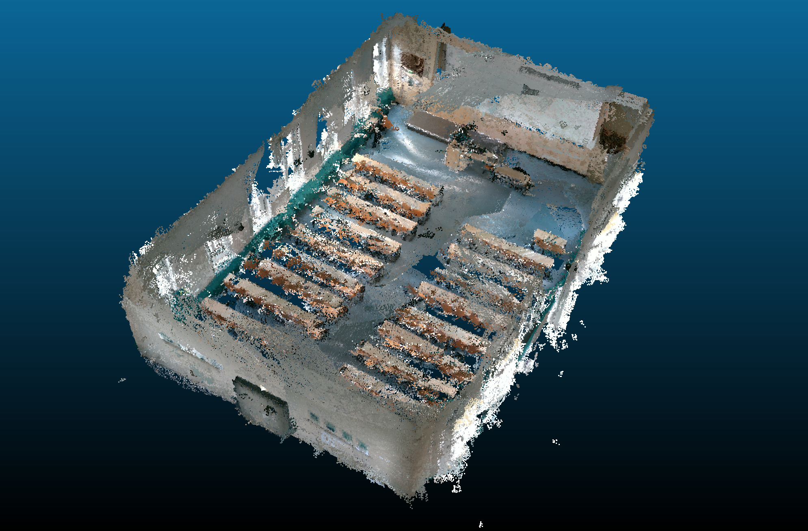
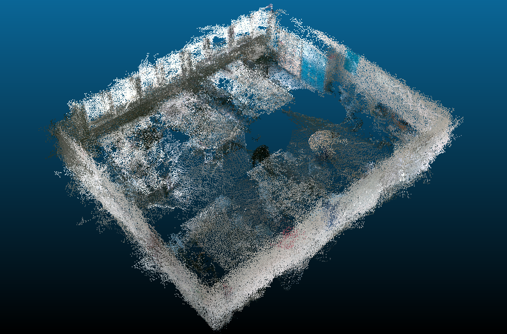
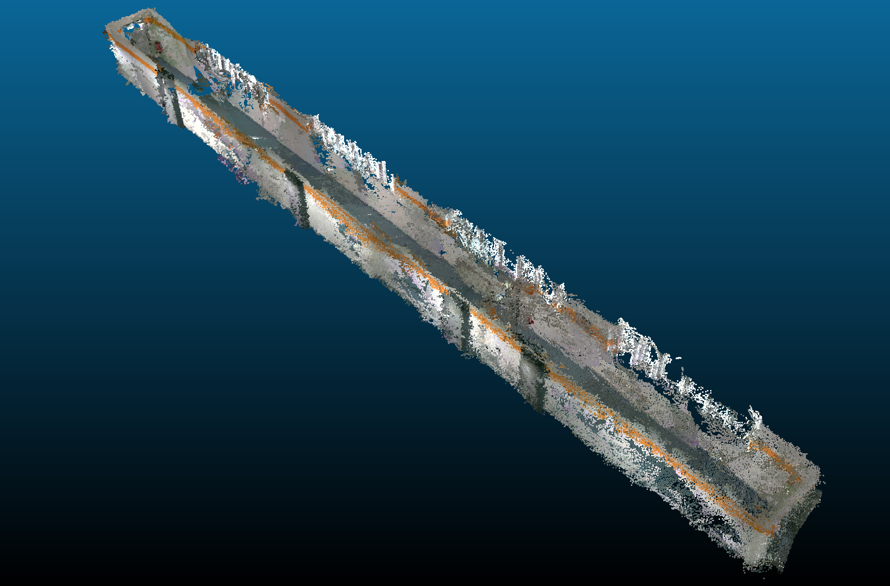
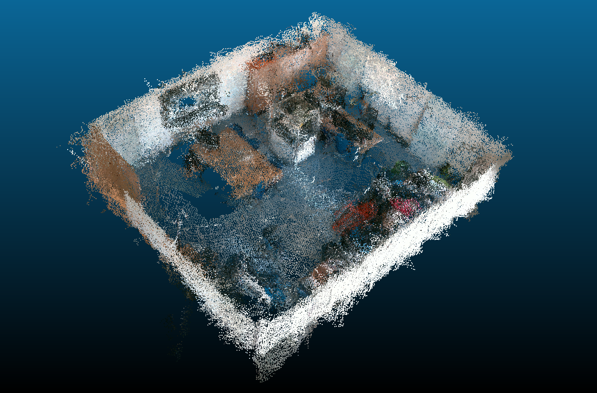

# FIN-Dataset
Four scenes recorded inside the CS building of OvGU Magdeburg (**F**akultät der **IN**formatik).

The recording setup was the Intel Realsense ROS 1 node with a dual camera setup using the Intel T265 tracking and D455 RGB-D cameras.

As the dataset was created and used for the evaluation of plane detection algorithms, each scene folder includes the individual clouds in .txt and .pcd file format, as well as the ground truth.
## Statistics
The duration reports the time spent on a recording, the maximum size denotes the number of points of the last point cloud shown below. The rightmost column corresponds to the number of ground truth planes.

| Scene  | Duration | Max. Size | #Planes |
|:---------------:|:-----------------:|:------------------:|:---------------:|
| Auditorium      | 296               | 656.599            | 41              |
| Conference Room | 113               | 387.183            | 11              |
| Hallway         | 174               | 303.780            | 5               |
| Office          | 125               | 364.165            | 15              |
| **Total**       | **708**           | **1.711.727**      | **72**          |

## Final Snapshots
### Auditorium Scene

### Conference Room

### Hallway Scene

### Office Scene

